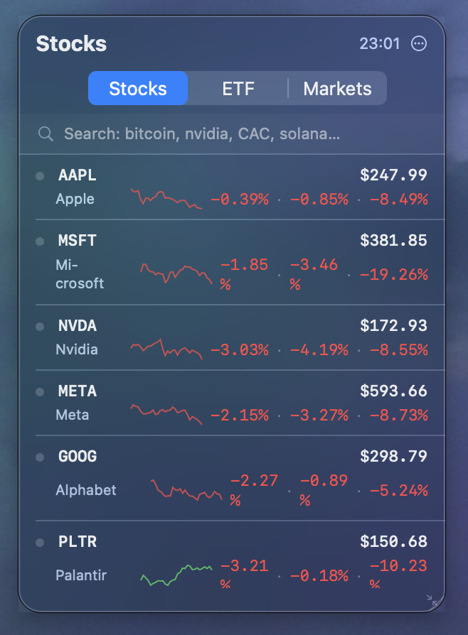

# stocks-desktop-widget

A native macOS desktop widget for monitoring stocks, ETFs, indices, forex, and crypto — always visible, never in your way.

Floats on your desktop like a weather widget. Translucent HUD panel that sits behind all your windows, visible across all Spaces. A compact menu bar indicator keeps your portfolio direction one glance away.

Built with SwiftUI, powered by [`ticker-cli`](https://github.com/sderosiaux/ticker-cli).

---

## What it looks like



Every row shows the ticker, a sparkline, current price, and daily / weekly / YTD performance at a glance. Hover to reveal the remove button or ETF composition.

The menu bar shows `▲ 1.2%` or `▼ 0.8%` at all times. Click it to show or hide the widget.

---

## Features

- **3 tabs** — Stocks / ETF / Markets (indices, forex, crypto — no futures)
- **Sparklines** — 30-day price chart inline on every row, green or red
- **Live search** — type any name or ticker symbol, filtered to major exchanges
- **Add / remove** — click a search result to add; hover a row to remove
- **Trends** — daily · weekly · YTD always visible, tooltip on hover
- **ETF composition** — hover an ETF row, click the pie icon → top 10 holdings
- **Click any row** — opens Yahoo Finance 1Y chart in your browser
- **Market dot** — green = open, yellow = pre/post market, grey = closed
- **Menu bar indicator** — live portfolio direction, click to toggle the window
- **Smart refresh** — every minute during trading hours, slower at night and weekends
- **Instant startup** — shows last known prices from disk cache while fetching
- **Resizable** — drag the bottom-right corner; position and size remembered

---

## Default watchlist

| Tab | Tickers |
|-----|---------|
| Stocks | AAPL, MSFT, NVDA, META, GOOG, PLTR, ARM, TSM, AVGO |
| ETF | QQQ, SOXX, SMH, IGV, XLK, SPY, VGK |
| Markets | EUR/USD, CAC 40, DAX, Euro Stoxx 50, S&P 500 |

Search and add anything else — symbols persist across restarts.

---

## Requirements

- macOS 14+
- [`ticker-cli`](https://github.com/sderosiaux/ticker-cli) installed at `~/go/bin/ticker-cli`
- SwiftLint (`brew install swiftlint`) for the pre-commit hook

---

## Install

```bash
git clone https://github.com/sderosiaux/stocks-desktop-widget.git
cd stocks-desktop-widget
swift build -c release
cp .build/release/StocksWidget ~/.local/bin/
```

### Start at login

```bash
cp com.stocks-widget.plist ~/Library/LaunchAgents/
launchctl load ~/Library/LaunchAgents/com.stocks-widget.plist
```

---

## Usage

```bash
StocksWidget
# or during development:
swift run
```

The widget appears in the top-right corner. Drag to reposition. Drag the bottom-right corner to resize. No Dock icon — use the `···` menu to quit.

---

## Development

```bash
swift build     # debug build
swift run       # run directly
swiftlint lint  # check violations
```

Rebuild and restart after changes:

```bash
swift build -c release && cp .build/release/StocksWidget ~/.local/bin/StocksWidget
pkill StocksWidget && ~/.local/bin/StocksWidget &
```
